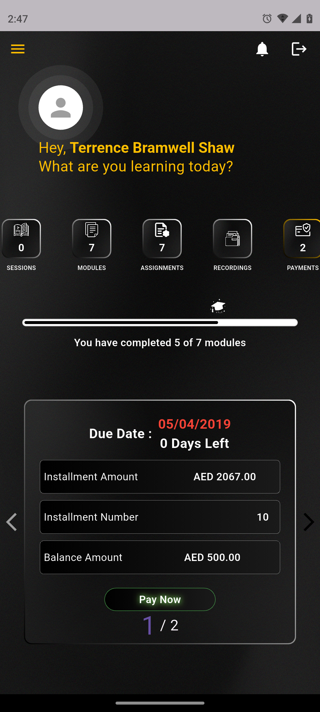
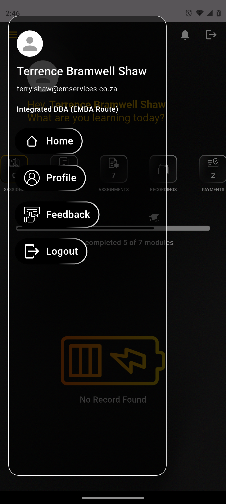
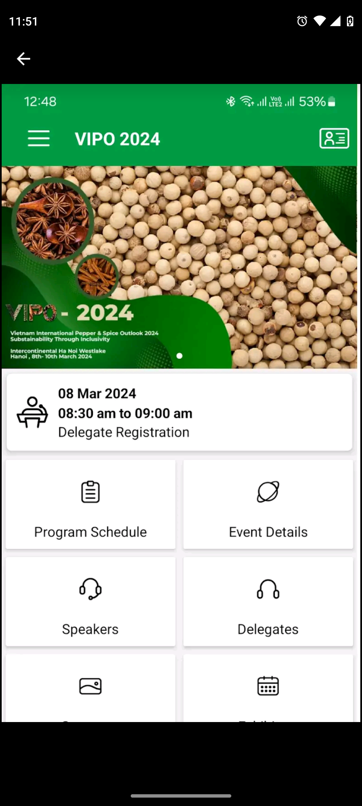
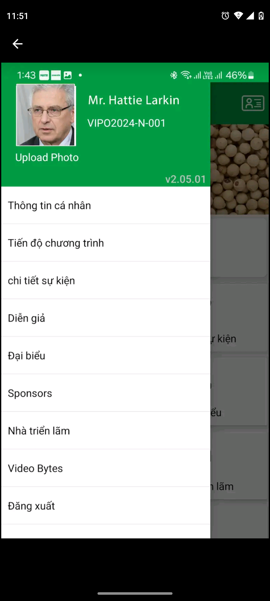
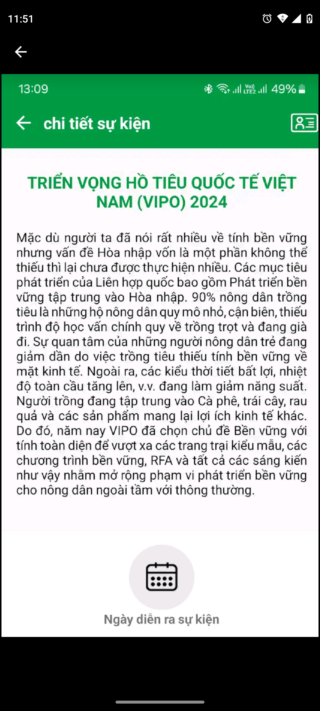
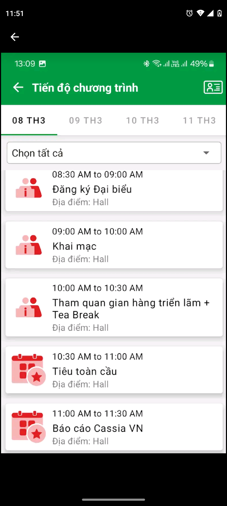
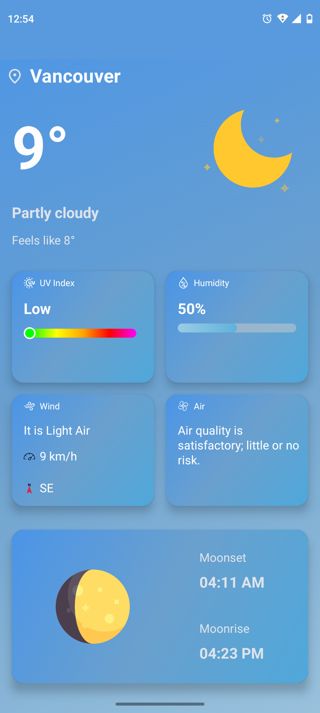

# Pooja Nandakumar
Android & Flutter Developer

📍 Vancouver, BC  
📧 poojanandakumar34@gmail.com  
🔗 GitHub: https://github.com/Poojanandakumar
🔗 LinkedIn: www.linkedin.com/in/poojanandakumar   

---

## About Me
Mobile application developer with professional experience in **native Android (Kotlin/Java)** and **cross-platform development using Flutter**. Skilled in building scalable, user-focused applications with clean architecture, API integration, and modern UI practices. Experienced in publishing and maintaining apps on the **Google Play Store**.

---

## Technical Skills
- **Languages:** Kotlin, Java, Dart  
- **Mobile:** Android SDK, Jetpack Compose, Flutter  
- **Architecture:** MVVM, MVI, Clean Architecture  
- **State Management:** Provider, Riverpod, BLoC/Cubit  
- **Backend & Data:** REST APIs, Room, Hive, Firebase Firestore  
- **Firebase:** Authentication, FCM, Crashlytics, Storage  
- **Tools:** Git, GitLab CI/CD, Android Studio, VS Code, Jira  

---

## Projects

### 📱Eaton Business School (Flutter)
**Role:** Flutter Developer  
**Tech:** Flutter, REST APIs, Firebase FCM, Hive, Provider/Riverpod/BLoC  

  
  
  
  

**Highlights:**
- Built a multi-role education management app for Eaton Business School enabling students, faculty, and admins to manage academic workflows.
- Implemented course and module management with structured learning content.
- Developed assignment lifecycle features including creation, submission, grading, and feedback.
- Integrated secure payment processing for course fees and student transactions.
- Enabled access to live and recorded class sessions within the app.
- Designed dashboards for admins to manage users, courses, and academic data

🔗 Play Store: https://play.google.com/store/apps/details?id=com.ebs.lms  

---

### 📱 Muthoot Mahila Mitra (Android)
**Company:** Muthoot Microfin Limited  
**Tech:** Kotlin, Jetpack Compose, MVVM, Room, CI/CD  

  
  
  
  

**Highlights:**
- Muthoot Mahila Mitra, a fintech mobile app enabling women customers to apply for and manage micro-loans.
- Implemented digital loan application flow with KYC capture and document uploads.
- Built loan dashboard displaying loan status, EMI schedules, interest details, and repayment history.
- Integrated secure authentication and role-based access for customers and field agents.
- Enabled real-time notifications for loan approval, disbursement, and repayment reminders.
- Ensured data security and performance for a large-scale user base.

🔗 Play Store: https://play.google.com/store/apps/details?id=com.muthootmicrofin.customerapp  

---

### 📱 VIPO (Android)
**Company:** Corbel Business Applications Pvt Ltd  
**Tech:** Kotlin, Java, MVVM, Hilt, Coroutines, Retrofit

  
  
  
  

**Highlights:**
- Built a full-featured exhibition app supporting visitors, exhibitors, and organizers.
- Implemented secure authentication, QR-based entry, and personalized schedules.
- Designed interactive venue maps with real-time navigation and geo-fenced alerts.
- Enabled exhibitor showcases, lead capture, and in-app networking.
- Integrated live sessions, feedback, ratings, and attendee engagement features.

🔗 Play Store: https://play.google.com/store/apps/details?id=apps.corbelbiz.vipo&hl=en&gl=US

---

### 📱 VIETNAM PEPPER APP - IPC (iOS)
**Company:** Corbel Business Applications Pvt Ltd  
**Tech:** Swift, Xcode, Alamofire, UIKit

  
  
  
  

**Highlights:**
- Developed the Vietnam Pepper app for product browsing, ordering, and inventory management
- Implemented secure checkout, order tracking, and push notifications for customers
- Built admin dashboards for product management and sales analytics
- Designed a responsive UI with smooth navigation and offline support
- Integrated REST APIs for real-time product and order management

🔗 App Store: https://apps.apple.com/ca/app/vietnam-pepper-app-ipc/id1455333398

---

### 📱 Weatherly (iOS)
**Hobby Project**  
**Tech:** Kotlin, Jetpack Compose, Hilt, Retrofit, Coroutine

  

**Highlights:**
- Personal Weather App project using Kotlin, Jetpack Compose, Hilt, ViewModel, and Retrofit
- Displays real-time weather data including forecasts, temperature, wind, and humidity
- Implemented clean architecture with MVVM, dependency injection, and reactive state management
- Designed modern, responsive UI with Compose animations and material components
- Includes error handling, loading states, and offline-friendly design
- Deployed on GitHub with clear documentation and screenshots

🔗 GitHub: https://github.com/Poojanandakumar/Weatherly

---

## Contact
📧 Email: poojanandakumar34@gmail.com  
🔗 GitHub: https://github.com/Poojanandakumar
🔗 LinkedIn: www.linkedin.com/in/poojanandakumar
